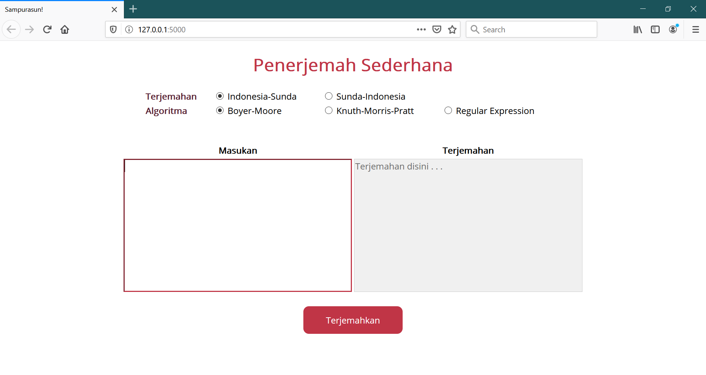

# Simple Sundanese Translator
Simple Sundanese to Bahasa Indonesia translator using Pattern Matching

## Getting Started
Aplikasi ini disusun dengan bahasa pemrograman Python dan memanfaatkan kakas Flask. 

### Prerequisite
Untuk menjalankan aplikasi ini, pastikan perangkat anda telah memiliki dependencies berikut ini:
- Python (versi 3.7.0)
- Flask (versi 1.1.2)

Untuk memeriksa apakah anda telah memiliki dependencies yang sesuai, anda dapat menjalankan perintah berikut pada CMD atau Terminal perangkat anda
- Windows
```script
python --version
Flask --version
```
- Linux (Ubuntu 18.04)
```
python3 -m Flask --version
```

### Installing
Anda dapat menggunakan perintah berikut pada CMD/terminal untuk menginstal prerequisites yang dibutuhkan
- Windows
```script
    pip install Flask==1.1.2
```
- Linux (Ubuntu 18.04)
```script
    pip3 install Flask==1.1.2
```

## Running The App
Jalankan perintah berikut pada command prompt/ terminal perangkat anda di direktori `src`
- Windows
```
    python app.py
```
- Linux
```
    python3 app.py
```
Apabila berhasil, anda akan melihat pesan berikut pada command prompt/ terminal anda
``` 
   Use a production WSGI server instead.
 * Debug mode: on
 * Restarting with stat
 * Debugger is active!
 * Debugger PIN: 107-696-203
 * Running on http://127.0.0.1:5000/ (Press CTRL+C to quit)
```

Jalankan aplikasi dengan mengakses link yang tertulis setelah pesan `Running on` , pada kasus ini, aplikasi diakses pada `http://127.0.0.1:5000/` akan memiliki tampilan sebagai berikut.


### Testing
Berikut ini adalah langkah untuk menjalankan aplikasi

1. Menjalankan program dengan perintah `python app.py` (sesuai langkah yang dijelaskan sebelumnya)
2. Memilih opsi terjemahan dan algoritma yang diinginkan
3. Memasukkan teks yang diinginkan pada kolom "Masukan"
4. Menekan tombol "Terjemahkan"
5. Hasil terjemahan akan muncul pada kolom teks "Terjemahan"


## Demo
Video demo aplikasi ini dapat diakses melalui link [berikut](https://youtu.be/h5-7ux_shN0)